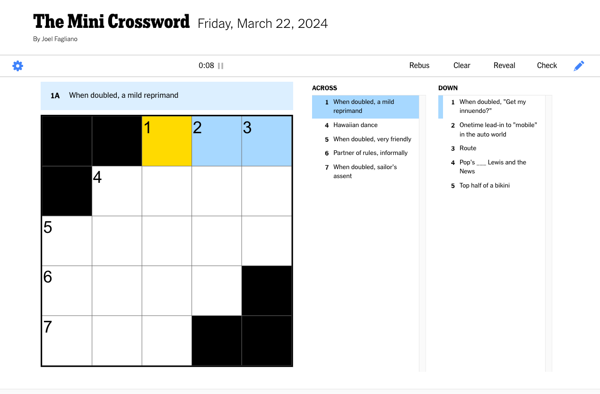

<!--
_class: intro-blue
-->

# &nbsp;
# Sharpen Your Brain with Crosswords

### Presented by: Tommy Falgout | Partner Solution Architect

---

# Agenda

- Why play crosswords?
- What are crosswords?
- How to get started
- Q&A

---

# Me

- Partner Solution Architect @ Microsoft (ex-Yahoo!, ex-Nortel)
- Builder of trebuchets (IMDB - Trebuchet Expert)
- And amazingly enough, Dad (14 yo daughter)
- Lover of puzzles

---

# My Journey

- Sucked into Wordle craze 
  - Nov 1st, 2021 - 90 people; Jan 2022 - 300,000 people
  - [NYT purchased Wordle](https://www.nytimes.com/2022/01/31/crosswords/nyt-wordle-purchase.html) (low seven figures)
- Long roadtrip called for more
- Downloaded NYT Games App

---

# What are crosswords?

noun: a puzzle consisting of a grid of squares and blanks into which words crossing vertically and horizontally are written according to clues.

---

# Why play crosswords?

- Keeps our brains active
- Can be meditative
- Helps us approach problems differently
- Learn new words, phrases, concepts, languages
- Learn about history and culture

<!-- Feeds a lot of my spotify -->

---

# How/where to play?

- MANY free ones
  - Can even [create your own](https://crosswordlabs.com/)!
- My favorite:  [NYT Crosswords](https://www.nytimes.com/crosswords)
  - [The Mini Crossword](https://www.nytimes.com/crosswords/game/mini)
  - NYT Games App (Wordle, Crossword Mini, Sudoku, Connections and more)

---

# NYT Guidelines

- Monday - easy & light
- Tuesday - trickier clues
- Wednesday - themed, gimmicky
- Thursday - f-off (REBUS)
- Friday - [EASY MODE!](https://www.nytimes.com/newsletters/easy-mode)
- Saturday - f-off (Hardest of week)
- Sunday - grab a friend and spend 1-2 hours together

---

# NYT Examples

For example, for the answer STRAP:

- Monday clue: “Subway rider’s handhold”
- Wednesday clue: “Part of a bike helmet”
- Saturday clue: “What might keep a watch on you”

---

# NYT Examples

For example, for the answer OREO:

- Monday clue: 
  - “Nabisco cookie”
  - “Cookie with creme filling”
  - “‘Twist, Lick, Dunk’ cookie”
- Late-week clues
  - “Snack since 1912”
  - “It has 12 flowers on each side”
  - “Sandwich often given a twist”

---

# Rebus

Def: A rebus is a puzzle device that combines the use of illustrated pictures with individual letters to depict words or phrases. 

---

# Rebus in Crosswords 

Def: "... anything that gets entered in a square that’s not a single letter of the alphabet. Typically, rebuses are parts of themes,” 

[The Crossword Stumper](https://www.nytimes.com/2020/06/22/crosswords/heck-rebus-crosswords-puzzles.html) article

---

# Create your own

You can [submit to the NYT Crossword!](https://www.nytimes.com/article/submit-crossword-puzzles-the-new-york-times.html)

Payment varies based on the day of the week and number of puzzles you’ve had published with The New York Times.

 
| Puzzles | Size | Published 1 – 2 | Published 3+ |
| --- | --- | --- | --- |
| Monday – Saturday | 15 x 15 | $500 | $750 |
| Sunday | 21 x 21 | $1,500 | $2,250 |

Diversity in cultural references — for age, gender, ethnicity, etc. — is desired.

---

# Rules

- All answers must be at least 3 letters long
- Answers do not have the world in the clue
- Can be +1 word and/or phrase
- Must follow
  - Plurality (-s, -es)
  - Tense (-ed, -ing)
  - Comparison (-er, -est)
- Sometimes REBUS or tricks (Thurs & Sat)

---

# Gotchas

- "?" clues - Don't take literally (pun or alternative word)
  - Example: 8 letters: Job that might involve watching the kids
- "quoted" clues - Spoken words, not concept
  - Example: 3 letters: "Just a heads-up ..."
- "_" clues - Fill in the word
  - Example: 4 letters: Hip-hop's Wu-Tang _
- Informal grammar
  - Example: 4 letters: "How ya _?"

<!-- GOAT HERD -->  
<!-- FYI -->  
<!-- CLAN -->  
<!-- DOIN -->  
---

# Guidelines for beginners

- Start with:
  - Monday
  - "Gimmes"
  - Small words
- Use "pencil mode" for guesses
- Walk away, return refreshed
- Not easy, but should be satisfying
  - Solving them is like muscle
- Solve with a friend
- Research IS NOT CHEATING

---

# What if I'm stuck?!

- Research IS NOT CHEATING
  - Especially for IYKYK
- Hints / Debrief
  - NYT Official page for "today's puzzle"
  - [Rex Parker](https://rexwordpuzzle.blogspot.com/)
- Reveal + Autocorrect
  - Break your streak, but are there for a reason!

---

# DO IT LIVE!

[The Mini Crossword](https://www.nytimes.com/crosswords/game/mini)

---

# Inspirations / Sources

- https://www.nytimes.com/interactive/2017/07/27/crosswords/CROSSWORDS-beginners.html
- https://www.crosswordsolver.org/guides/how-to-solve-a-crossword-puzzle-for-beginners
- https://www.nytimes.com/article/submit-crossword-puzzles-the-new-york-times.html
- https://rexwordpuzzle.blogspot.com/